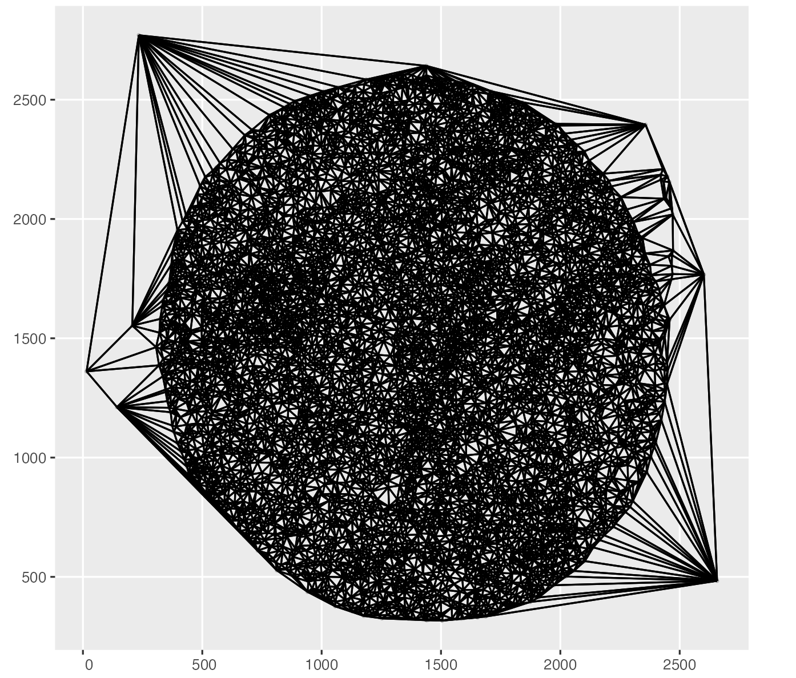
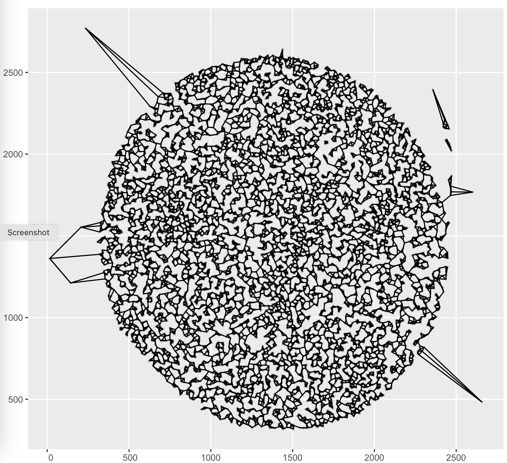
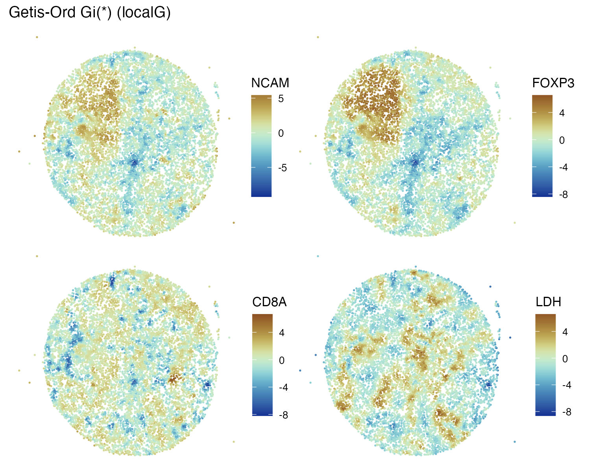

# GBCC.mcm

This package is in development for a presentation at Galaxy-Bioconductor Community Conference
2025.

The main purpose is to illustrate analysis of MCMICRO spatial proteomics experiments.

Given an image and associated protein quantifications from the platform, what computations
facilitate biological interpretation?

An important determinant of statistical analysis is the approach to defining
distance between cells.  Here's a default cell-cell distance 'graph':

Here's an alternative with neighbor distances for a given
cell produced only for the three nearest cells.

Statistics concerning spatial distributions of cell attributes
depend upon the definition of cell-cell distance.

Getis-Ord's Gi* statistic is reported on a Z-score scale and
has been used to characterize hot spots in spatial surveys.

This package will provide code to help explore aspects of such data and analyses.
