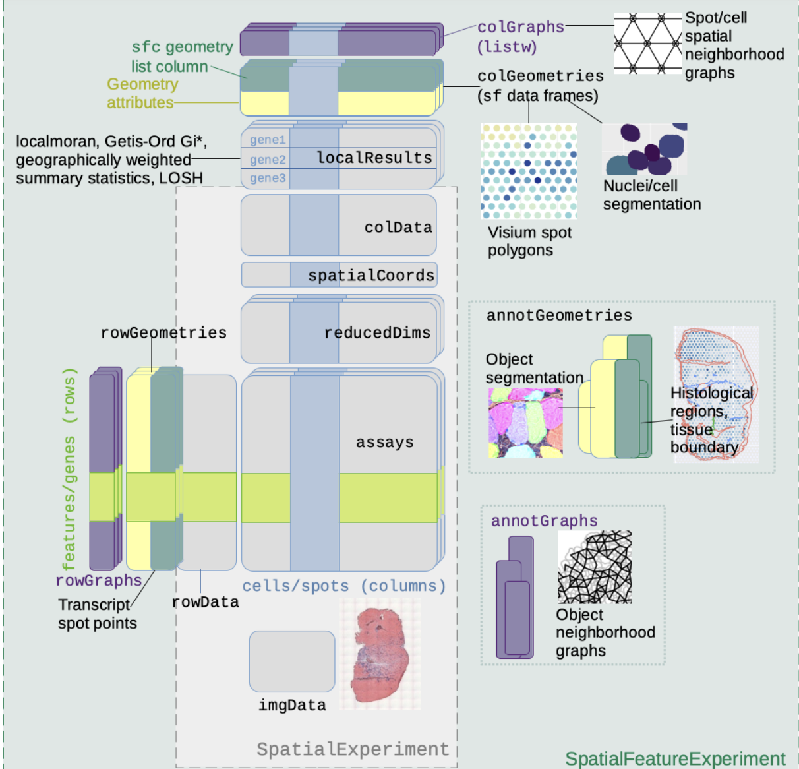

# Introduction

This package illustrates use of MCMICRO spatial proteomics data.

As of Feb 1 2025, some of the code used to produce this
vignette is in github.com, not in Bioconductor or CRAN.

# Data availability

Data in the form of h5ad files were supplied by Jeremy Goecks.
These were ingested and transformed to 
[SpatialFeatureExperiment](https://bioconductor.org/packages/SpatialFeatureExperiment)
instances using the `process_mcmicro` function in the [GBCC.mcm](https://github.com/vjcitn/GBCC.mcm) package.



The SpatialFeatureExperiment (SFE) instances were serialized
using [alabaster.sfe](https://github.com/pachterlab/alabaster.sfe),
and the folders zipped and placed on NSF Open Storage Network.
We retrieve, cache, and deserialize using the following code.

```{r get1,message=FALSE}
library(GBCC.mcm)
library(alabaster.sfe)
library(Voyager)
pa = path_to_zipped_mcm("m53.1")
tf = tempfile()
unzip(pa, exdir=tf)
targ = dir(tf, full=TRUE)
m53.1 = readObject(targ)
m53.1
```

Available experiments are named m53.1(1)4 and m62.1.

# Analytic preparation

The `process_mcmicro` will ingest the MCMICRO-galaxy h5ad output
and perform some basic analytic tasks.

- A "colGraph" is produced to encode cell-cell distances.
- Local statistics based on Moran's I and Getis-Ord Gi* are computed.

Results of these tasks are bound with the SFE instances.

## Spatial neighborhood graph

The default spatial neighbors graph for the experiment retrieved
above:
```{r lkgr}
plotColGraph(m53.1)
```

## Local statistics

```{r lkloc}
localResultNames(m53.1)
```

A display of Z-scores for spatial clustering for four
proteins assayed in the experiment is:

```{r lkgi}
features_use = c("NCAM", "FOXP3", "CD8A", "LDH")
Voyager::plotLocalResult(m53.1, "localG", features = features_use,
                 colGeometryName = "centroids", divergent = TRUE,
                 diverge_center = 0)
```

